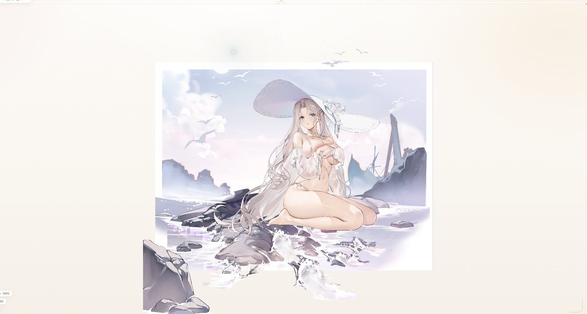
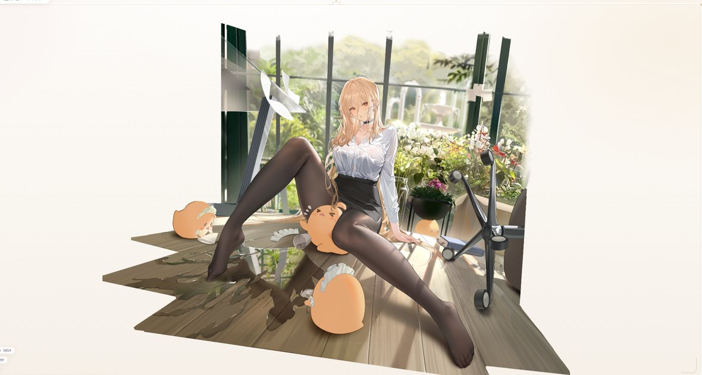
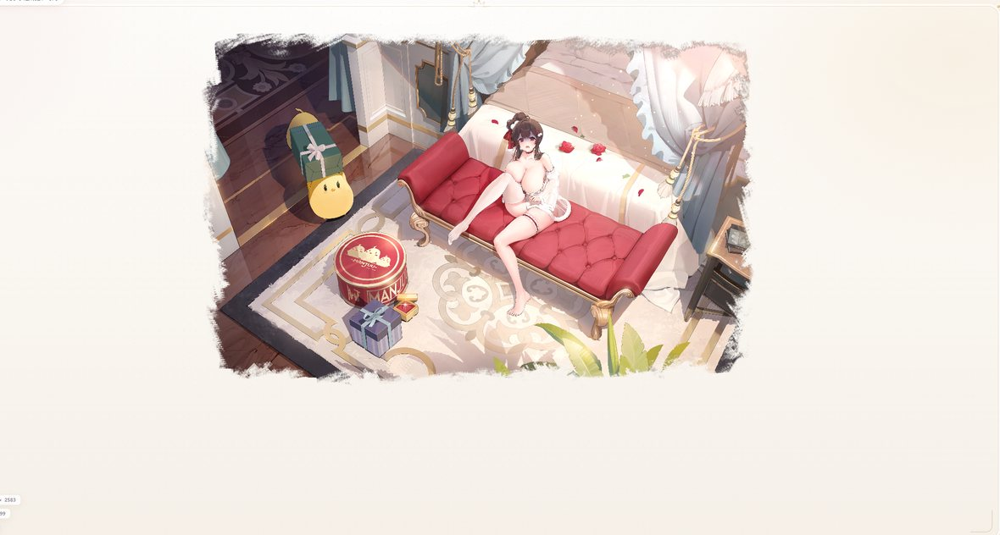

# 动态立绘预览页 · 界面升级与渲染修复

本文记录对 `docs/player/` 预览器的改造：整体视觉升级为 **婚礼白（Wedding White）** 主题，并修复了立绘渲染、图层叠加、缩略图与相机交互四类问题。

改造后的页面支持两种打开方式：本地静态服务，或直接双击 `index.html`。

---

## 一、视觉效果升级

### 1. 婚礼白主题

原先界面为深色科技风，现已整体切换为柔和的白金配色：

- 背景由深蓝黑改为暖白渐变，叠加极淡的暖金径向光晕。
- 主色调定为香槟金 `#c9a86a`，点缀色为淡樱粉 `#ebc4d2`。
- 卡片、按钮统一为圆角白底 + 细金描边 + 柔和投影。
- 站点图标改为圆形金边徽记，呼应主题。

`index.html` 的 `<body>` 增加 `theme-wedding-white` 类，全部配色集中在 `style.css` 顶部的 CSS 变量中，便于后续换肤。

### 2. 侧栏与舞台

- 品牌区新增 `Azur Lane · Spine Gallery` 副标题，主标题改用衬线字体。
- 品牌区下方加入一条装饰分隔线（线条 + 菱形 + 圆环）。
- 侧栏底部新增信息栏，展示当前主题与「资源索引」跳转入口。
- 舞台四周增加一层细金描边画框，四角带铆钉装饰，顶部居中有一枚手绘风王冠，纯 SVG 绘制、无额外图片依赖。

### 3. 交互反馈

- 监听列表、动作面板、图层胶囊、控制栏的悬停与选中态统一为金色描边 + 轻微上浮。
- 键盘快捷键提示改为圆角胶囊样式。
- 加载失败与本地直开模式的提示条，采用文案内嵌代码样式，信息更明确。

---

## 二、渲染与交互修复

### 1. 多层立绘叠加（核心修复）

碧蓝航线的立绘资源是**分层文件**，例如武藏共 8 个 `.skel`（身体、头发、舰装、和谐层等），只有全部叠加才是完整原画。旧版只加载其中一个文件，导致画面只显示局部碎片。

现在 `startPlayer()` 会取出当前皮肤下的全部图层并逐一创建播放器，同时新增 `fitUnionViewport()`：对所有图层的骨架包围盒取并集，把并集作为公共视口下发给每个播放器，从而让各层像素级对齐。

```js
ready.forEach(function (p) {
  p.config.viewport = {
    x: x1, y: y1, width: vw, height: vh,
    padLeft: 0, padRight: 0, padTop: 0, padBottom: 0,
    transitionTime: 0.0001
  };
});
```

播放、暂停、切换动作与重置视图，统一通过 `eachPlayer()` 作用到所有图层，避免只动底层导致画面不同步。图层的 DOM 容器设置为透明背景，保证上层画布不遮挡下层绘制。

### 2. 图层叠放顺序

图层文件名带后缀标记：`T` 为前景、`M` 为中景、`B` 为背景、`hx` 为和谐层。若直接按索引叠加，像 `……_2B` 这类背景层会被画在人物之上。

新增 `layerRank()` 按语义权重排序后再渲染，权重为 `B(0) < M(1) < 主体(2) < T(3) < hx(4)`：

```js
function layerRank(item) {
  var name = String((item && item.skelName) || "").replace(/\.[^.]+$/, "");
  if (/_hx$/i.test(name)) return 4;
  if (/T$/i.test(name)) return 3;
  if (/M$/i.test(name)) return 1;
  if (/B$/i.test(name)) return 0;
  return 2;
}
```

### 3. 相机变换累乘导致缩放漂移

旧版 `applyTransform()` 使用 `cam.position.x += panX` 与 `cam.zoom *= zoom` 的累加写法，而该函数在滚轮、拖拽、就绪回调中都会触发，于是偏移量被反复叠加，表现为画面越缩放越大、越拖越偏。

现改为基于基准值的绝对赋值，并在所有图层加载完成后用 `captureBase()` 记录一次基准：

```js
function applyTransform() {
  var cam = camera();
  if (!cam) return;
  cam.position.x = (state.baseX || 0) + state.panX;
  cam.position.y = (state.baseY || 0) + state.panY;
  cam.zoom = (state.baseZoom || 1) * state.zoom;
}
```

### 4. 列表缩略图错位

旧版缩略图直接取图集页 PNG，但图集是散乱图元的拼图，不是完整原画，加上 `transform: scale(1.25)` 造成溢出，显示为错位碎片。

现改为固定尺寸的裁剪容器 + 舰娘中文首字占位，去除会导致溢出的缩放，视觉效果稳定统一。

### 5. 画框不再遮挡画面

上一版为营造主题加的半透明白色画框正好压住立绘。现在画框背景改为完全透明，仅保留描边与角落装饰，另删除了覆盖在画布上的暗角层。

---

## 三、本地运行

浏览器在 `file://` 协议下会因同源策略拦截对本地 `.json` 的读取，因此直开页面时需要预先生成内联索引：

```powershell
python tools/build-player-data.py
```

该脚本把 `docs/index.json` 转换为两个纯 JS 数据文件：

- `docs/player/index.local.js`：供 `file://` 直接双击打开使用。
- `docs/player/index.embed.js`：供本地服务与 Pages 场景使用。

`load-time-data.js` 会在解析阶段按协议同步注入对应脚本，确保 `app.js` 执行前数据已就绪。

推荐的启动方式仍是本地服务，直接双击仓库根目录的启动脚本即可：

```powershell
start-local-preview.cmd
```

脚本在 `127.0.0.1:13383` 起静态服务并自动打开预览页，优先使用 Python，缺失时回退到 Node。

---

## 四、代表性皮肤验证

以下三张截图取自本次改造后的实际渲染结果，分别覆盖了不同的图层组织方式。

### 约克城II · 白昼美人鱼

该皮肤为 `yuekechengii_2T` + `yuekechengii_2B` 两层结构，是验证叠放顺序的典型用例：背景若先渲染，会把人物整个盖住。



资源目录：`docs/yuekechengii/yuekechengii_2/`

### 怨仇 · 办公室的“意外”

该皮肤为 `yuanchou_2` + `yuanchou_2_hx` 两层结构，其中和谐层按权重排在最后，主体与办公室场景正常叠合。



资源目录：`docs/yuanchou/yuanchou_2/`

### 绫濑 · 兔子小姐的更衣时间

该皮肤为单层结构，但图集拆成两张 PNG（`linglai_2.png` 与 `linglai_22.png`）。这张图用于验证「单图层 + 多图集页」场景不受叠加逻辑影响。



资源目录：`docs/linglai/linglai_2/`

---

## 五、改动文件

| 文件 | 说明 |
| --- | --- |
| `docs/player/style.css` | 婚礼白主题、画框与装饰、缩略图样式 |
| `docs/player/index.html` | 主题类名、品牌区与装饰元素、提示条 |
| `docs/player/app.js` | 多层叠加、图层排序、相机变换修正、多图层同步控制 |
| `docs/player/load-time-data.js` | 按协议注入内联索引数据 |
| `tools/build-player-data.py` | 由 `index.json` 生成内联数据脚本 |
| `start-local-preview.cmd` | 一键启动本地预览服务 |
| `docs/images/skins/` | 本文档使用的示例截图 |